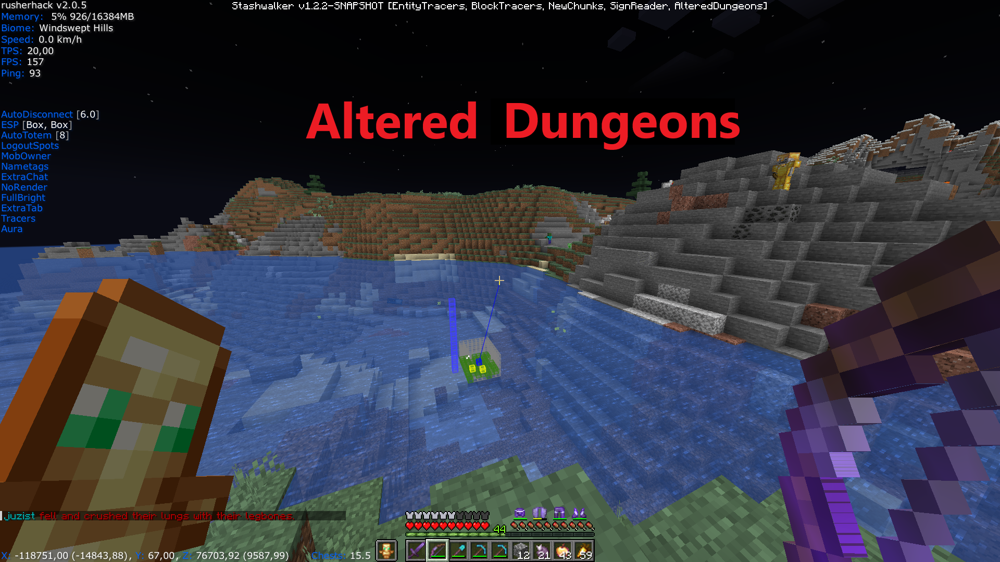
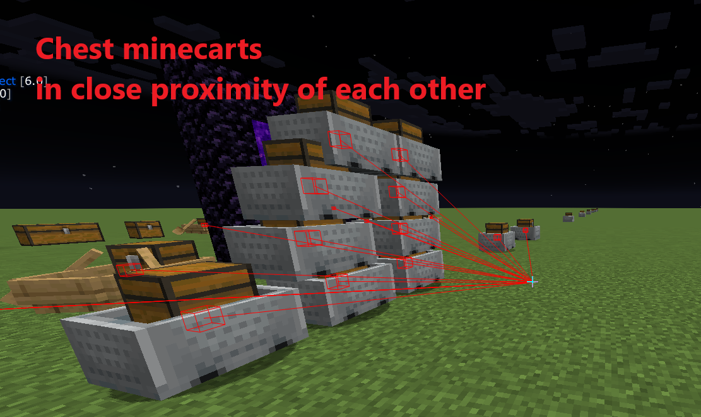
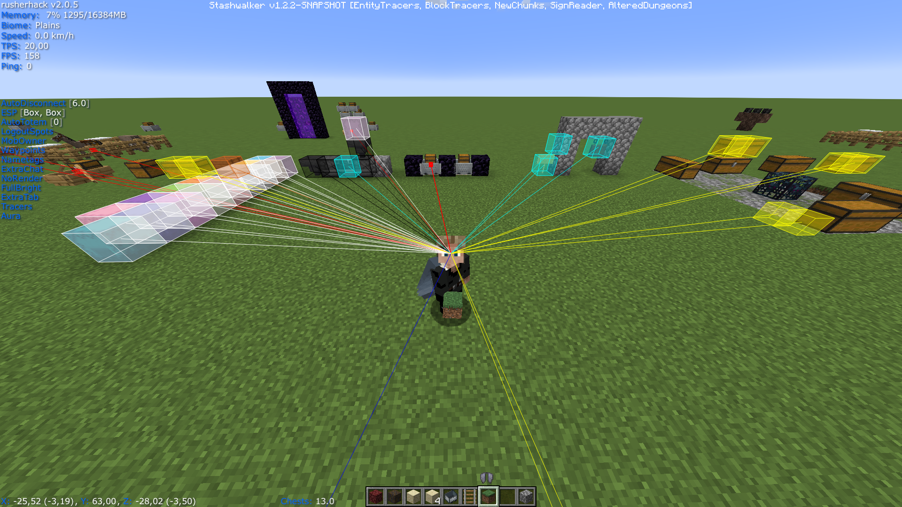

# Fabric Stashwalker Mod

Mod that can be used alongside a hacked client like Rusherhack, Meteor or Future Client to find valuable items.
This mod is open source, you can check the code yourself. This mod has been tested on 2b2t.

## Features

### Entity Tracer

Draws a tracer to valuable items and entities that may contain items:
- stacked chest minecarts: if multiple chest minecarts are stacked in the same place (if the shadow under the minecarts is very dark this is an indication that there are a lot stacked on each other)
- if a lot of chest minecarts are in close proximity of eachother, but not stacked (the amount and distance can be configured)
- chest boats
- llama's and donkeys that have chests
- elytra's
- enchanted gapps
- enchanted diamond/netherite armor
- enchanted diamond/netherite tools
- enchanted diamond/netherite weapons
- xp bottles
- totems
- item frames
- end crystals

### Block Tracers 

Different colored tracers to interesting blocks:
- containers
    - shulkerboxes
    - double chests (that are not in a dungeon)
    - barrels
    - hoppers
    - droppers
    - dispensers
    - blast furnaces
    - furnaces
- signs
- warning message if blocks are found near (old) build limit

### New Chunks

Renders rectangles around new chunks (based on copper ore in the Overworld and ancient debris in the Nether), enabling you to follow chunk trails

### Sign Reader 

Posts text of signs you pass by in the chat HUD

### Altered Dungeons 

A common way people try to hide small stashes is in dungeon chests. This feature will show if a pillar of blocks above the dungeon has been altered

### Keybindings

Configure the keybindings in the options menu

### Mod Configuration

Configure mod configudation in the mod menu

## How to build jar from source

- install git, gradle and java 
- clone the project: git clone https://github.com/LukeStashWalker/stashwalker.git
- build with the following command in the project folder using git bash: ./gradlew build 
- the jar will be in the build/libs/ folder

<!-- ## How to run -->
<!-- - ./gradlew runClient --debug-jvm -->

## Pre-built jars

- can be found in the 'releases' folder

## How to use

- place the jar inside your Minecraft mods folder
- this mod has the following dependencies:
	-	"fabricloader": ">=0.16.5",
	-	"minecraft": "1.21.1",
	-	"java": "21",
	-	"fabric-api": ">=0.103.0+1.21.1"

## Tip

- if you run into Minecraft memory issues you can do the following: runner -> installations -> your installation -> ... -> edit -> more options -> update the value of xmx in JVM arguments to 4G or higher

## Contact

- feedback or feature requests can be sent to original_plan_c@hotmail.com
- patreon.com/LukeStashWalker

