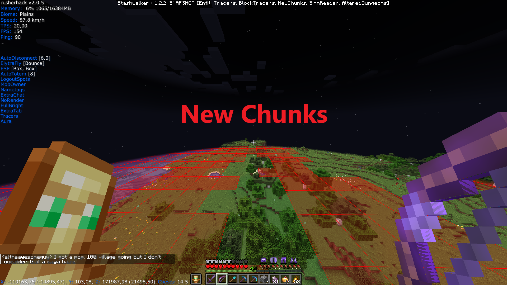

# Fabric Stashwalker Mod

Mod that can be used alongside a hacked client like Rusherhack, Meteor or Future Client.
This mod is open source, you can check the code yourself. This mod has been tested on 2b2t.

## Features

- configure keybindings in options menu
- red entity tracers, draws a tracer to valuable items and entities that may contain items:
    - stacked chest minecarts: if multiple chest minecarts are stacked in the same place
    - chest boat
    - llama's and donkeys that have chests
    - elytra item
    - enchanted gapp item
    - diamond/netherite armor item
    - diamond/netherite tool item
    - xp bottle item
    - totem item
    - smithing template item
- blue block entity tracers, draws a blue tracer to:
    - any double chest if the chest is not in a dungeon
    <!-- - single or double chest if the chest is in a dungeon with a broken spawner (potential kit shop dropoff location) -->
- new chunks: renders red rectangles around 1.19+ chunks, enabling you to follow chunk trails
- sign reader: posts text of signs you pass by in chat HUD

<!--  -->

## How to build jar from source

- build: ./gradlew build 
- the jar will be in the build/libs/ directory

## Pre-built releases

- can be found in the 'releases' folder

## How to use

- place the jar inside your Minecraft mods directory
- this mod has the following dependencies:
    - "fabricloader": ">=0.15.11",
	- "minecraft": "1.20.4",
	- "java": "17",
	- "fabric-api": "*"

## Contact

- feedback or feature requests can be sent to original_plan_c@hotmail.com
- patreon.com/LukeStashWalker
