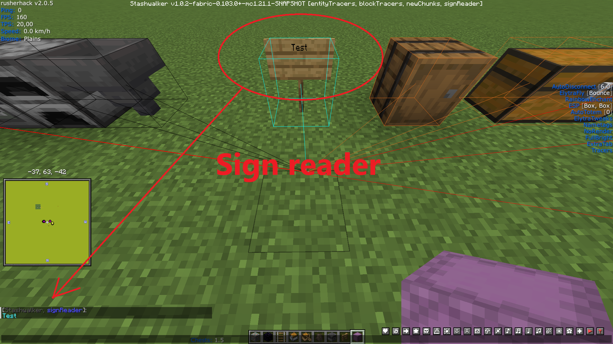
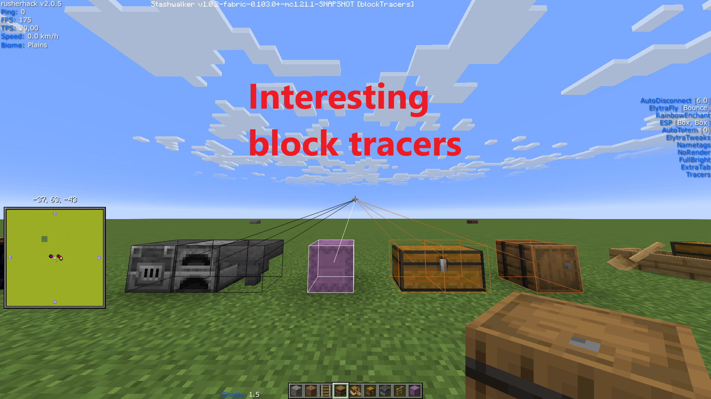
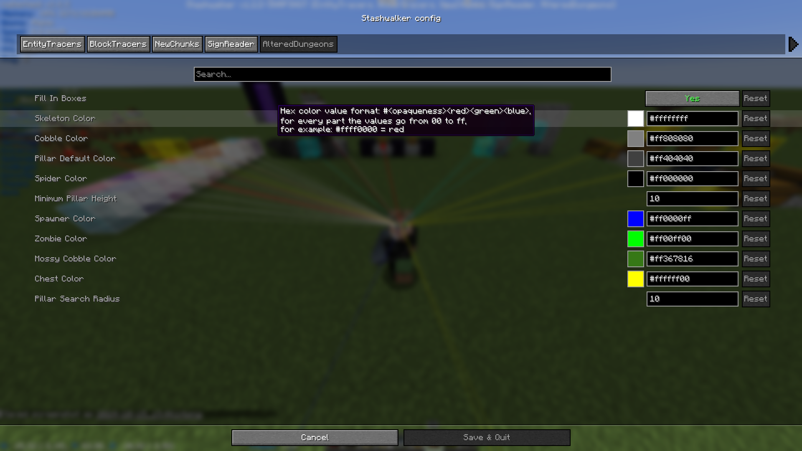

# Fabric Stashwalker Mod

Mod that can be used alongside a hacked client like Rusherhack, Meteor or Future Client.
This mod is open source, you can check the code yourself. This mod has been tested on 2b2t.

## Features

- configure keybindings in options menu
- red entity tracers, draws a tracer to valuable items and entities that may contain items:
    - stacked chest minecarts: if multiple chest minecarts are stacked in the same place (if the shadow under the minecarts is very dark this is an indication that there are a lot stacked on each other)
    - chest boat
    - llama's and donkeys that have chests
    - elytra item
    - enchanted gapp item
    - enchanted diamond/netherite armor item
    - enchanted diamond/netherite tool item
    - enchanted diamond/netherite weapon item
    - xp bottle item
    - totem item
    - item frame
    - smithing template item
    - end crystal
- different colored tracers to interesting blocks:
    - white
        - shulkerbox
    - yellow
        - any double chest that is not in a dungeon
    - brown
        - barrel
    - black
        - hopper
        - dropper
        - dispenser
        - blast furnace
        - furnace
    - cyan
        - any type of sign
- if solid blocks are found at build limit a warning message is posted in the chat HUD (this feature is enabled when the block tracers feature is enabled)
    <!-- - single or double chest if the chest is in a dungeon with a broken spawner (potential kit shop dropoff location) -->
- new chunks: renders rectangles around new chunks (based on copper ore in the Overworld and ancient debris in the Nether), enabling you to follow chunk trails
- sign reader: posts text of signs you pass by in the chat HUD
- altered dungeons: this feature highlights a dungeon if it has been altered (somebody has been inside the dungeon). It checks for pillars in a radius above the dungeon. A pillar block (can also be air) is defined as a block for which all blocks around it horizontally are of a different type than that block. It there are 5 or more pillar blocks above each other, a pillar is detected. When a dungeon is detected it also highlights zombies, skeletons and spiders. If there are multiple of these mobs already inside the dungeon this can be an indication that these mobs where spawned when the player was leaving the dungeon. Some biomes like deserts or swamps can give false positives, but based on the colors of the blocks of the pillar you should be able to see this from a distance

<!--  -->

## How to build jar from source

- build: ./gradlew build 
- the jar will be in the build/libs/ directory

<!-- ## How to run -->
<!-- - ./gradlew runClient --debug-jvm -->

## Pre-built releases

- can be found in the 'releases' folder

## How to use

- place the jar inside your Minecraft mods directory
- this mod has the following dependencies:
	-	"fabricloader": ">=0.16.5",
	-	"minecraft": "1.21.1",
	-	"java": "21",
	-	"fabric-api": ">=0.103.0+1.21.1"

## Tip

- if you run into memory issues you can do the following: runner -> installations -> your installation -> ... -> edit -> more options -> update the value of xmx in JVM arguments to 4G or higher

## Contact

- feedback or feature requests can be sent to original_plan_c@hotmail.com
- patreon.com/LukeStashWalker

