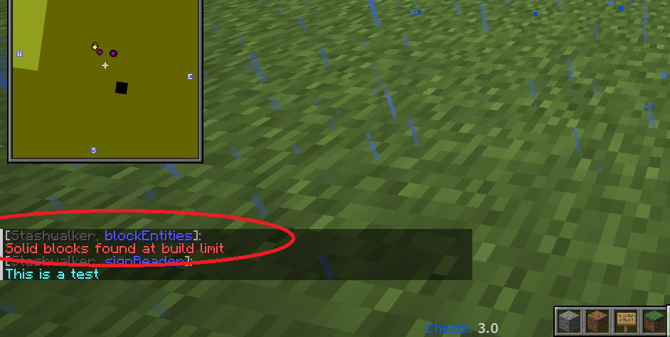

# Fabric Stashwalker Mod

Mod that can be used alongside a hacked client like Rusherhack, Meteor or Future Client.
This mod is open source, you can check the code yourself. This mod has been tested on 2b2t.

## Features

- configure keybindings in options menu
- red entity tracers, draws a tracer to valuable items and entities that may contain items:
    - stacked chest minecarts: if multiple chest minecarts are stacked in the same place
    - chest boat
    - llama's and donkeys that have chests
    - elytra item
    - enchanted gapp item
    - diamond/netherite armor item
    - diamond/netherite tool item
    - xp bottle item
    - totem item
    - smithing template item
- different colored tracers to interesting blocks:
    - white
        - shulkerbox
    - brown
        - any double chest that is not in a dungeon
        - barrel
    - black
        - hopper
        - dropper
        - dispenser
        - blast furnace
        - furnace
    - cyan
        - any type of sign
- if solid blocks are found at build limit a warning message in posted in the chat HUD
    <!-- - single or double chest if the chest is in a dungeon with a broken spawner (potential kit shop dropoff location) -->
- new chunks: renders rectangles around new chunks (based on copper ore in the Overworld and ancient debris in the Nether), enabling you to follow chunk trails
- sign reader: posts text of signs you pass by in the chat HUD

<!--  -->

## How to build jar from source

- build: ./gradlew build 
- the jar will be in the build/libs/ directory

## Pre-built releases

- can be found in the 'releases' folder

## How to use

- place the jar inside your Minecraft mods directory
- this mod has the following dependencies:
	-	"fabricloader": ">=0.16.5",
	-	"minecraft": "1.21.1",
	-	"java": "21",
	-	"fabric-api": ">=0.103.0+1.21.1"
- if you want to be able to configure the block tracer colors in the mod menu then also these:
	- "modmenu": ">=11.0.2",
	- "cloth-config": ">=15.0.130-fabric"

## Contact

- feedback or feature requests can be sent to original_plan_c@hotmail.com
- patreon.com/LukeStashWalker
